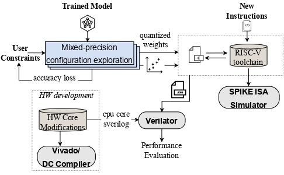
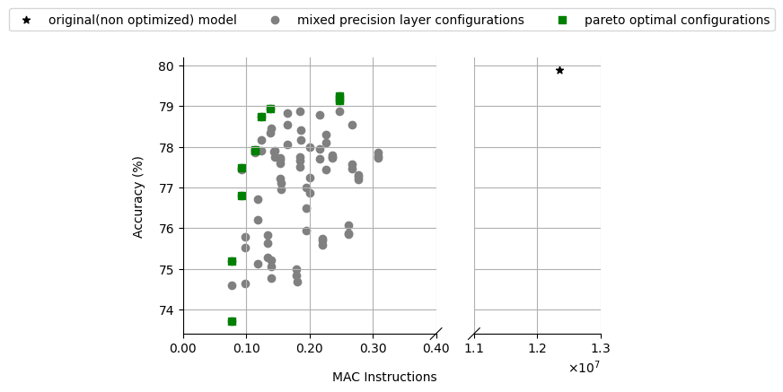
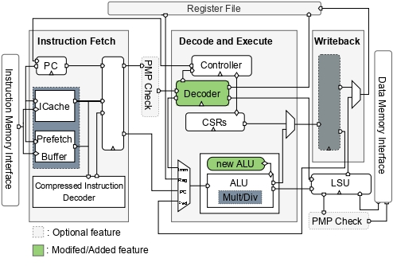
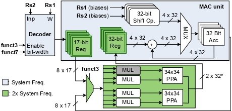

# Redes Neuronales de Precisión Mixta en Núcleos RISC-V

- [Descripción General](#Overview)
- [Compilar la Cadena de Herramientas RISC-V](#Build-the-RISC-V-Toolchain)
- [Cuantificación de Precisión Mixta](#Mixed-Precision-Quantization)
- [Arquitectura RISC-V](#RISC-V-Architecture)
- [Simulación de Inferencia Usando Verilator](#Inference-Simulation-Using-Verilator)

## Descripción General

El creciente interés en implementar aplicaciones de aprendizaje automático (ML) en dispositivos con capacidad de procesamiento y energía limitada subraya la necesidad de soluciones de computación que no solo destaquen en eficiencia energética y de memoria, sino que también garanticen baja latencia para aplicaciones sensibles al tiempo. Las investigaciones han demostrado que parámetros individuales con baja precisión variable pueden alcanzar precisiones comparables a sus contrapartes de precisión completa. Sin embargo, los microprocesadores embebidos modernos ofrecen un soporte muy limitado para Redes Neuronales de Precisión Mixta, tanto en extensiones del Conjunto de Instrucciones (ISA) como en su diseño de hardware para la ejecución eficiente de operaciones de precisión mixta, es decir, introduciendo varios cuellos de botella de rendimiento debido a las numerosas instrucciones para empaquetar y desempaquetar datos, el subaprovechamiento de unidades aritméticas, etc.

En este trabajo, proponemos extensiones de ISA adaptadas a optimizaciones de hardware de precisión mixta, dirigidas a la inferencia de Redes Neuronales Profundas eficiente en energía en las principales arquitecturas de CPU RISC-V. Para ello, introducimos un marco de co-diseño hardware-software que permite el diseño cooperativo de hardware, cuantificación de precisión mixta, extensiones de ISA e inferencia en emulaciones con precisión de ciclo.

Este repositorio incluye:
1. Instrucciones para actualizar la cadena de herramientas RISC-V con nuevas instrucciones personalizadas.
2. Ejemplos que demuestran la cuantificación de redes neuronales utilizando variables de precisión mixta. Se emplean técnicas como la Cuantificación Post-Entrenamiento (PTQ) y el Entrenamiento Consciente de la Cuantificación (QAT), aprovechando la biblioteca Brevitas.
3. Detalles sobre la arquitectura RISC-V, que extiende el núcleo lowRISC Ibex (escrito en SystemVerilog).
4. Códigos de inferencia escritos en C, tanto con como sin la integración de nuevas instrucciones. Estos códigos fueron simulados en el procesador RISC-V utilizando Verilator. El repositorio proporciona instrucciones exhaustivas para compilar las simulaciones y probar los resultados.
    
<!--  - Instrucciones para mapear el procesador en una placa FPGA o un diseño ASIC utilizando herramientas como Vivado y Synopsys, junto con procedimientos para obtener datos sobre área, temporización y consumo de energía.
-->

Un breve resumen de todo el proceso se puede ver en el siguiente diagrama de flujo:

<p align="center">

</p>

## Compilar la Cadena de Herramientas RISC-V
Para comenzar, primero compilaremos la cadena de herramientas RISC-V. Antes de continuar, asegúrese de que todas las dependencias necesarias estén instaladas en el sistema:
```
sudo apt-get install autoconf automake autotools-dev curl python3 libmpc-dev libmpfr-dev libgmp-dev gawk \
	                         build-essential bison flex texinfo gperf libtool patchutils bc zlib1g-dev libexpat-dev
```

A continuación, clone la cadena de herramientas desde el repositorio oficial:

```
git clone https://github.com/riscv/riscv-gnu-toolchain
cd riscv-gnu-toolchain
git submodule update --init --recursive
```

Para implementar las modificaciones en la cadena de herramientas GNU de RISC-V, siga los cambios detallados para los siguientes archivos:

1. **Ruta del archivo**: `path/to/riscv-gnu-toolchain/binutils/include/opcode/riscv-opc.h`

    ```c
    #ifndef RISCV_ENCODING_H
    #define RISCV_ENCODING_H
   
    #define MATCH_NEUR_INIT 0x1047
    #define MASK_NEUR_INIT 0xfe00707f

    #define MATCH_NEUR_MACC_8B 0x10002047
    #define MASK_NEUR_MACC_8B 0xfe00707f

    #define MATCH_NEUR_MACC_4B 0x08002047
    #define MASK_NEUR_MACC_4B 0xfe00707f

    #define MATCH_NEUR_MACC_2B 0x04002047
    #define MASK_NEUR_MACC_2B 0xfe00707f

    #define MATCH_NEUR_RES 0x4047
    #define MASK_NEUR_RES 0xfe00707f

    ...
    #endif /* RISCV_ENCODING_H */

    #ifdef DECLARE_INSN
   
    DECLARE_INSN(neur_init, MATCH_NEUR_INIT, MASK_NEUR_INIT)

    DECLARE_INSN(nn_mac_8b, MATCH_NEUR_MACC_8B, MASK_NEUR_MACC_8B
    DECLARE_INSN(nn_mac_4b, MATCH_NEUR_MACC_4B, MASK_NEUR_MACC_4B)
    DECLARE_INSN(nn_mac_2b, MATCH_NEUR_MACC_2B, MASK_NEUR_MACC_2B)
    
    DECLARE_INSN(neur_res, MATCH_NEUR_RES, MASK_NEUR_RES)

    #endif /* DECLARE_INSN */
    ```

2. **Ruta del archivo**: `path/to/riscv-gnu-toolchain/binutils/opcodes/riscv-opc.c`

    ```c
    ...

    const struct riscv_opcode riscv_opcodes[] =
    {

      {"neur_init", 0, INSN_CLASS_I, "d,s,t", MATCH_NEUR_INIT, MASK_NEUR_INIT, match_opcode, 0},

      {"nn_mac_8b", 0, INSN_CLASS_I, "d,s,t", MATCH_NEUR_MACC_8B, MASK_NEUR_MACC_8B, match_opcode, 0},
      {"nn_mac_4b", 0, INSN_CLASS_I, "d,s,t", MATCH_NEUR_MACC_4B, MASK_NEUR_MACC_4B, match_opcode, 0},
      {"nn_mac_2b", 0, INSN_CLASS_I, "d,s,t", MATCH_NEUR_MACC_2B, MASK_NEUR_MACC_2B, match_opcode, 0},

      {"neur_res", 0, INSN_CLASS_I, "d,s,t", MATCH_NEUR_RES, MASK_NEUR_RES, match_opcode, 0},
    ...
    ```

Ahora, configuremos e instalemos la cadena de herramientas, incluyendo las instrucciones personalizadas. Para el núcleo Ibex, requerimos el conjunto de instrucciones RV32IMC:

```
./configure --prefix=/opt/riscv --with-arch=rv32imc --with-abi=ilp32 --with-isa-spec=2.2
sudo make && make install
sudo make clean
```

Debemos asegurarnos de que los directorios que contienen las herramientas de RISC-V estén incluidos en la variable de entorno **PATH**. Dado que nuestros binarios se encuentran en **'/opt/riscv/bin'**, debemos agregarlo a nuestro PATH en el archivo de configuración del shell (**'~/.bashrc'** o **'~/.bash_profile'**):

```
export PATH=$PATH:/opt/riscv/bin
```

Después de agregar esta línea, aplique los cambios:

```
source ~/.bashrc
```

Finalmente, deberíamos verificar que el compilador GCC de RISC-V y otras herramientas sean accesibles. Ejecute el siguiente comando para comprobar la versión del compilador GCC de RISC-V:

```
riscv32-unknown-elf-gcc --version
```

Debería ver una salida similar a:

```
riscv32-unknown-elf-gcc (gc891d8dc23e) 13.2.0
Copyright (C) 2023 Free Software Foundation, Inc.
This is free software; see the source for copying conditions.  There is NO
warranty; not even for MERCHANTABILITY or FITNESS FOR A PARTICULAR PURPOSE.
```

## Cuantificación de Precisión Mixta

El siguiente paso implica crear el Modelo Cuantizado utilizando la biblioteca [Brevitas](https://github.com/Xilinx/brevitas). Para comenzar, debemos adquirir el modelo de precisión completa, ya sea importando una versión preentrenada o entrenándola desde cero. Una vez que tengamos el modelo, evaluaremos su precisión en el conjunto de datos proporcionado. Posteriormente, replicaremos la arquitectura del modelo y sustituiremos sus capas por las versiones cuantizadas correspondientes disponibles en la biblioteca Brevitas. Finalmente, necesitamos determinar la precisión adecuada para los pesos de cada capa. Se pueden explorar dos opciones:

  1. Exploración del Espacio de Diseño "**Exhaustiva**". Este método nos permite observar cómo se comporta nuestra red al utilizar diferentes configuraciones de pesos. Es adecuado para modelos relativamente pequeños (hasta 5 o 6 capas) y garantiza encontrar la solución óptima. Sin embargo, para modelos más grandes, la eficiencia se vuelve crucial. Para agilizar el proceso, podemos cuantizar uniformemente capas consecutivas y tratarlas como una sola unidad, o utilizar un ancho de bits fijo para los pesos de las capas con menor carga de trabajo. Aunque este enfoque puede generar soluciones subóptimas, los resultados suelen ser satisfactorios. Para utilizar este enfoque para una red dada, podemos establecer la variable *max_acc_drop* en *None*.

<p align="center">

</p>

  2. En el segundo caso, el usuario establece la degradación máxima de precisión permitida. Utilizamos un algoritmo de búsqueda binaria a través de una matriz preseleccionada de todas las configuraciones posibles del modelo, ordenadas por sus latencias proyectadas. Este enfoque mejora significativamente la eficiencia al examinar únicamente `log2(3^L)` configuraciones, identificando rápidamente una solución que cumple con los requisitos de precisión del usuario. Para utilizar este enfoque para una red específica, necesitamos establecer la variable *max_acc_drop* en un valor específico.

Finalmente, una vez que se determina la configuración óptima que se ajusta a nuestras restricciones, procedemos a generar automáticamente los archivos que se utilizarán para la inferencia (y simulación) de la QNN en nuestro núcleo RISC-V extendido. Más específicamente, crearemos archivos que contengan:
  - Los valores de pesos y sesgos para cada capa.
  - Los valores de escala para la conversión de los resultados acumulados de 32 bits de vuelta a 8 bits. La ecuación matemática para este procedimiento se describe en [[1]](#1).
  - El código C que delinea la funcionalidad de la Red Cuantizada.

Ejemplos completos que implementan el procedimiento descrito anteriormente se encuentran en este [subdirectorio](https://github.com/alexmr09/Mixed-precision-Neural-Networks-on-RISC-V-Cores/tree/main/mpq).

## Arquitectura RISC-V
### Núcleo RISC-V Ibex

El diseño base utilizado en este trabajo es una implementación genérica de la microarquitectura de Ibex, un núcleo de CPU RISC-V de 32 bits de código abierto escrito en SystemVerilog. Ibex fue desarrollado inicialmente como parte de la [plataforma PULP](https://www.pulp-platform.org) bajo el nombre ["Zero-riscy"](https://doi.org/10.1109/PATMOS.2017.8106976), y ha sido contribuido a [lowRISC](https://www.lowrisc.org), quienes lo mantienen y lo desarrollan aún más. Se encuentra en desarrollo activo.
El núcleo CPU es altamente parametrizable y muy adecuado para aplicaciones de control embebido. Ibex está siendo extensamente verificado y ha visto múltiples lanzamientos a fabricación. Ibex soporta las extensiones de Entero (I) o Embebida (E), Multiplicación y División de Enteros (M), Comprimida (C) y B (Manipulación de Bits).

<p align="center">
	
</p>

Puede explorar el código base del repositorio Ibex en GitHub visitando [lowRISC/ibex](https://github.com/lowRISC/ibex).

### Modificaciones en el Núcleo Ibex

#### Extensiones del decodificador para precisión mixta

Dado que el decodificador del sistema inicialmente no está configurado para reconocer las instrucciones recién introducidas, las modificaciones al decodificador son imperativas, junto con la integración del acelerador. Al actualizar el decodificador, nos aseguramos de que pueda interpretar con precisión los campos de opcode y código de función de estas nuevas instrucciones. Esta modificación permite que el decodificador identifique y diferencie correctamente las nuevas instrucciones, extraiga los valores necesarios de los registros de origen y, posteriormente, reenvíe esta información a la unidad recién agregada.

#### Diseño de la Unidad Aritmético-Lógica de Precisión Mixta

El objetivo general es amplificar el rendimiento de operaciones MAC por ciclo, una métrica crítica para la eficiencia computacional en el procesamiento de redes neuronales, mientras se minimiza simultáneamente la utilización de recursos y el consumo de energía. Estas optimizaciones nos permitirán activar el predictor de caché del sistema y utilizar las banderas de optimización avanzadas del compilador GCC, lo que resultará en la generación de código más rápido y eficiente, sin tener que detener la pipeline del procesador. Los más notables son:

  - La explotación de los recursos del procesador, y más específicamente de sus multiplicadores
  - El uso de una pipeline dentro de la estructura de la unidad para hacer el sistema más robusto y aumentar el rendimiento.
  - **Multi-Pumping**: Utilizamos un reloj de frecuencia doble para la implementación de los componentes con mayor carga de trabajo.
  - **Soft SIMD**: Empacamos 2 multiplicaciones dentro de un único multiplicador cuando se solicita calcular los productos entre pesos de 2 bits y las entradas de 8 bits de cada capa.

<p align="center">
	
</p>

## Simulación de Inferencia Usando Verilator

Para la simulación de nuestras QNN en el núcleo Ibex modificado, con Verilator, podemos compilar y probar ya sea:

- [Ibex Simple System](https://github.com/lowRISC/ibex/tree/master/examples/simple_system), que es un sistema basado en Ibex que puede ejecutar binarios independientes y contiene el núcleo, una sola memoria para instrucciones y datos, y un periférico básico para escribir salida ASCII.
  
- [Ibex Demo System](https://github.com/lowrisc/ibex-demo-system), que es un SoC RISC-V de ejemplo dirigido a la placa FPGA Arty-A7 que incluye el núcleo junto con soporte para UART, GPIO, PWM, Temporizador, SPI y depuración.

Todos los archivos necesarios para los 2 diseños se encuentran en el directorio [extended_ibex](https://github.com/alexmr09/Mixed-precision-Neural-Networks-on-RISC-V-Cores/tree/main/extended_ibex).

### Construcción de la Simulación

#### Prerrequisitos
- [Verilator](https://www.veripool.org/verilator/) (recomendamos compilar la versión 5.008). En resumen, para instalar desde git: 
  ```
  # Prerrequisitos:
  sudo apt-get install git help2man perl python3 make autoconf g++ flex bison ccache
  sudo apt-get install libgoogle-perftools-dev numactl perl-doc
  sudo apt-get install libelf-dev
  sudo apt-get install srecord
  sudo apt-get install libfl2  # Solo Ubuntu (ignorar si da error)
  sudo apt-get install libfl-dev  # Solo Ubuntu (ignorar si da error)
  sudo apt-get install zlibc zlib1g zlib1g-dev  # Solo Ubuntu (ignorar si da error)
  
  git clone http://git.veripool.org/git/verilator
  
  # Cada vez que necesite compilar:
  unsetenv VERILATOR_ROOT  # Para csh; ignore el error si usa bash
  unset VERILATOR_ROOT # Para bash
  cd verilator

  git pull  # Asegúrese de que estamos actualizados
  git checkout v5.008

  autoconf
  ./configure
  make -j$(nproc)
  sudo make install
  ```

  Al final, puede verificar que Verilator se instaló correctamente revisando su versión:

  ```
  verilator --version
  ```
  La salida debe ser la siguiente:

  ```
  Verilator 5.008 2023-03-04 rev v5.008
  ```
  
- [FuseSoC](https://github.com/olofk/fusesoc), un gestor de paquetes premiado y un conjunto de herramientas de compilación para código HDL (Lenguaje de Descripción de Hardware), para automatizar el proceso de compilación de las simulaciones. Ibex utiliza una [bifurcación personalizada](https://github.com/lowRISC/fusesoc/tree/ot) de FuseSoC, por lo que debemos instalarlo mediante este método en lugar de instalar FuseSoC por separado. Para las dependencias del proyecto, es más apropiado usar un entorno virtual:
  ```
  python3 -m venv .venv
  source .venv/bin/activate
  pip3 install -U -r python-requirements.txt
  ```
  
Para compilar la simulación del Simple System, ejecute desde su directorio el siguiente comando (mientras aún se encuentra dentro del entorno virtual):

```
cd extended_ibex/ibex_simple_system/
fusesoc --cores-root=. run --target=sim --setup --build lowrisc:ibex:ibex_simple_system --RV32E=0 --RV32M=ibex_pkg::RV32MSingleCycle
```

De manera similar, para compilar la simulación del Demo System (el que mapearemos en el dispositivo FPGA) ejecute desde su directorio lo siguiente:

```
cd extended_ibex/ibex_demo_system/
fusesoc --cores-root=. run --target=sim --tool=verilator --setup --build lowrisc:ibex:demo_system
```
Una vez terminado, podemos desactivar el entorno virtual ejecutando:

```
deactivate
```

### Compilación de Software

Para compilar el ejecutable C apropiado para nuestra Red Neuronal Cuantizada, primero debemos asegurarnos de que el archivo C generado anteriormente junto con los archivos de encabezado que contienen los parámetros y entradas de la red comprimida se encuentren en el mismo directorio dentro del directorio de [códigos de inferencia](https://github.com/alexmr09/Mixed-precision-Neural-Networks-on-RISC-V-Cores/tree/main/inference_codes). Dentro de este directorio, encontrará ejemplos de software compatibles que funcionan para ambas simulaciones de sistema.
Además, en el subdirectorio [common](https://github.com/alexmr09/Mixed-precision-Neural-Networks-on-RISC-V-Cores/tree/main/inference_codes/common), encontrará los kernels optimizados que incluyen las instrucciones personalizadas.

Por ejemplo, para compilar el ejemplo de LeNet5 MNIST, desde el repositorio raíz ejecute:
```
make -C inference_codes/lenet5_mnist/optimized
```

El programa .elf compilado está disponible en [inference codes/lenet5_mnist/optimized](https://github.com/alexmr09/Mixed-precision-Neural-Networks-on-RISC-V-Cores/tree/main/inference_codes/lenet5_mnist/optimized). El mismo directorio también contiene un archivo de memoria Verilog (archivo vmem) para usar con algunos simuladores.

### Ejecución del Simulador

Habiendo compilado el simulador y el software, para simular usando Verilator podemos usar los siguientes comandos.
`<sw_elf_file>` debe ser una ruta a un archivo ELF (o alternativamente un archivo vmem) compilado como se describe arriba. Pase `-t` para obtener una traza VCD de la ejecución.

```
# Para la Simulación del Simple System:
./extended_ibex/ibex_simple_system/build/lowrisc_ibex_ibex_simple_system_0/sim-verilator/Vibex_simple_system [-t] --meminit=ram,<sw_elf_file>

# Para la Simulación del Demo System:
./extended_ibex/ibex_demo_system/build/lowrisc_ibex_demo_system_0/sim-verilator/Vibex_demo_system [-t] --meminit=ram,<sw_elf_file>

# Por ejemplo:
./extended_ibex/ibex_demo_system/build/lowrisc_ibex_demo_system_0/sim-verilator/Vibex_demo_system \
  --meminit=ram,./inference_codes/lenet5_mnist/optimized/lenet5_mnist.elf
```

Podemos utilizar la salida de la simulación para extraer mediciones sobre la latencia de nuestro programa y estimar la aceleración con respecto al núcleo Ibex original.

```
Simulation statistics
=====================
Executed cycles:  488901
Wallclock time:   12.188 s
Simulation speed: 40113.3 cycles/s (40.1133 kHz)

Performance Counters
====================
Cycles:                     480856
NONE:                       0
Instructions Retired:       334753
LSU Busy:                   121484
Fetch Wait:                 2168
Loads:                      117569
Stores:                     3915
Jumps:                      7
Conditional Branches:       45792
Taken Conditional Branches: 8224
Compressed Instructions:    43
Multiply Wait:              0
Divide Wait:                0
```

## Referencias

<a name="1"> [1] </a> Benoit Jacob, Skirmantas Kligys, Bo Chen, Menglong Zhu, Matthew Tang, Andrew
Howard, Hartwig Adam, and Dmitry Kalenichenko. Quantization and training of
neural networks for efficient integer-arithmetic-only inference, 2017.

## Citación

Si encuentra útil nuestro proyecto, considere citar los siguientes trabajos:

**Giorgos Armeniakos**, **Alexis Maras**, **Sotirios Xydis**, and **Dimitrios Soudris**.
*Mixed-Precision Neural Networks on RISC-V Cores: ISA Extensions for Multi-Pumped Soft SIMD Operations.*
In *Proceedings of the 43rd IEEE/ACM International Conference on Computer-Aided Design (ICCAD '24)*.
Association for Computing Machinery, New York, NY, USA, Article 235, 1–9.
[https://doi.org/10.1145/3676536.3676840](https://doi.org/10.1145/3676536.3676840)


**G. Armeniakos**, **A. Maras**, **S. Xydis**, and **D. Soudris**.
*MaRVIn: A Cross-Layer Mixed-Precision RISC-V Framework for DNN Inference, from ISA Extension to Hardware Acceleration.*
*IEEE Transactions on Computer-Aided Design of Integrated Circuits and Systems*, 2025.
[https://doi.org/10.1109/TCAD.2025.3615505](https://doi.org/10.1109/TCAD.2025.3615505)
