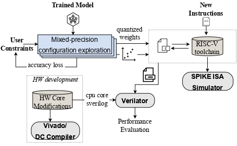
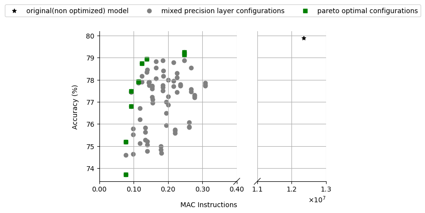
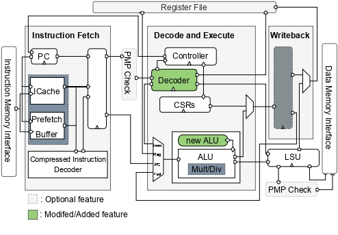
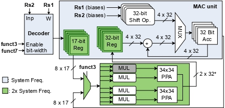

# Mixed-precision Neural Networks on RISC-V Cores

- [Overview](#Overview)
- [Build the RISC-V Toolchain](#Build-the-RISC-V-Toolchain)
- [Mixed Precision Quantization](#Mixed-Precision-Quantization)
- [RISC-V Architecture](#RISC-V-Architecture)
- [Inference Simulation Using Verilator](#Inference-Simulation-Using-Verilator)

## Overview

The growing interest in deploying machine learning (ML) applications on devices with restricted processing power and energy capacity underscores the necessity for computing solutions that not only excel in power and memory efficiency but also ensure low latency for time-sensitive applications. Research has shown that individual parameters with varying low precision, can attain accuracies comparable to full-precision counterparts. However, modern embedded microprocessors provide very limited support for mixed-precision Neural Networks regarding both Instruction Set Architecture (ISA) extensions and their hardware design for efficient execution of mixed-precision operations, i.e. introducing several performance bottlenecks due to numerous instructions for data packing and unpacking, arithmetic unit under-utilizations etc.

In this work, we propose ISA extensions tailored to mixed precision hardware optimizations, targeting energy-efficient Deep Neural Network inference on leading RISC-V CPU architectures. To this end, we introduce a hardware-software co-design framework that enables cooperative hardware design, mixed-precision quantization, ISA extensions and inference in cycle-accurate emulations.

This repository includes:
1. Instructions for updating the RISC-V toolchain with new custom instructions.
2. Examples demonstrating the quantization of neural networks using mixed-precision variables. Techniques such as Post-Training Quantization (PTQ) and Quantization-Aware Training (QAT) are employed, leveraging the Brevitas library.
3. Details on the RISC-V architecture, which extends the lowRISC Ibex core (written in SystemVerilog).
4. Inference codes written in C, both with and without the integration of new instructions. These codes were simulated on the RISC-V processor with the use of Verilator. The repository provides comprehensive instructions for building the simulations and testing the results.
    
<!--  - Instructions on mapping the processor onto an FPGA board or an ASIC design using tools like Vivado and Synopsys, along with procedures for retrieving data regarding area, timing, and power consumption.
-->

A brief overview of the whole process can be seen in the following flowchart:

<p align="center">

</p>

## Build the RISC-V Toolchain
To get started, we'll first build the RISC-V toolchain. Before proceeding, ensure that all necessary dependencies are installed on the system:
```
sudo apt-get install autoconf automake autotools-dev curl python3 libmpc-dev libmpfr-dev libgmp-dev gawk \
	                         build-essential bison flex texinfo gperf libtool patchutils bc zlib1g-dev libexpat-dev
```

Next, clone the toolchain from the official repository:

```
git clone https://github.com/riscv/riscv-gnu-toolchain
cd riscv-gnu-toolchain
git submodule update --init --recursive
```

To implement the modifications in the RISC-V GNU toolchain, adhere to the changes outlined for the following files:

1. **File Path**: `path/to/riscv-gnu-toolchain/binutils/include/opcode/riscv-opc.h`

    ```c
    #ifndef RISCV_ENCODING_H
    #define RISCV_ENCODING_H
   
    #define MATCH_NEUR_INIT 0x1047
    #define MASK_NEUR_INIT 0xfe00707f

    #define MATCH_NEUR_MACC_8B 0x10002047
    #define MASK_NEUR_MACC_8B 0xfe00707f

    #define MATCH_NEUR_MACC_4B 0x08002047
    #define MASK_NEUR_MACC_4B 0xfe00707f

    #define MATCH_NEUR_MACC_2B 0x04002047
    #define MASK_NEUR_MACC_2B 0xfe00707f

    #define MATCH_NEUR_RES 0x4047
    #define MASK_NEUR_RES 0xfe00707f

    ...
    #endif /* RISCV_ENCODING_H */

    #ifdef DECLARE_INSN
   
    DECLARE_INSN(neur_init, MATCH_NEUR_INIT, MASK_NEUR_INIT)

    DECLARE_INSN(nn_mac_8b, MATCH_NEUR_MACC_8B, MASK_NEUR_MACC_8B
    DECLARE_INSN(nn_mac_4b, MATCH_NEUR_MACC_4B, MASK_NEUR_MACC_4B)
    DECLARE_INSN(nn_mac_2b, MATCH_NEUR_MACC_2B, MASK_NEUR_MACC_2B)
    
    DECLARE_INSN(neur_res, MATCH_NEUR_RES, MASK_NEUR_RES)

    #endif /* DECLARE_INSN */
    ```

2. **File Path**: `path/to/riscv-gnu-toolchain/binutils/opcodes/riscv-opc.c`

    ```c
    ...

    const struct riscv_opcode riscv_opcodes[] =
    {

      {"neur_init", 0, INSN_CLASS_I, "d,s,t", MATCH_NEUR_INIT, MASK_NEUR_INIT, match_opcode, 0},

      {"nn_mac_8b", 0, INSN_CLASS_I, "d,s,t", MATCH_NEUR_MACC_8B, MASK_NEUR_MACC_8B, match_opcode, 0},
      {"nn_mac_4b", 0, INSN_CLASS_I, "d,s,t", MATCH_NEUR_MACC_4B, MASK_NEUR_MACC_4B, match_opcode, 0},
      {"nn_mac_2b", 0, INSN_CLASS_I, "d,s,t", MATCH_NEUR_MACC_2B, MASK_NEUR_MACC_2B, match_opcode, 0},

      {"neur_res", 0, INSN_CLASS_I, "d,s,t", MATCH_NEUR_RES, MASK_NEUR_RES, match_opcode, 0},
    ...
    ```

Now, let's configure and install the toolchain, with the custom instructions included. For the Ibex core, we require the RV32IMC instruction set:

```
./configure --prefix=/opt/riscv --with-arch=rv32imc --with-abi=ilp32 --with-isa-spec=2.2
sudo make && make install
sudo make clean
```

We will need to make sure that the directories containing the RISC-V tools are included in the **PATH** environment variable. Since our binaries are located in **'/opt/riscv/bin'** , we must add it to our PATH in the shell configuration file (**'~/.bashrc'** or **'~/.bash_profile'**):

```
export PATH=$PATH:/opt/riscv/bin
```

After adding this line, apply the changes:

```
source ~/.bashrc
```

Finally, we should verify that the RISC-V GCC compiler and other tools are accessible. Run the following command to check the RISC-V GCC compiler version:

```
riscv32-unknown-elf-gcc --version
```

You should see output similar to:

```
riscv32-unknown-elf-gcc (gc891d8dc23e) 13.2.0
Copyright (C) 2023 Free Software Foundation, Inc.
This is free software; see the source for copying conditions.  There is NO
warranty; not even for MERCHANTABILITY or FITNESS FOR A PARTICULAR PURPOSE.
```

## Mixed Precision Quantization

The next step involves creating the Quantized Model using the [Brevitas](https://github.com/Xilinx/brevitas) Library. To begin, we must acquire the full-precision model, either by importing a pre-trained version or training it from scratch. Once we have the model, we will evaluate its accuracy on the given dataset. Following this, we will replicate the model's architecture and substitute its layers with the corresponding quantized versions available in the Brevitas library. Finally, we need to determine the appropriate weight precision for each layer. Two options can be explored:

  1. "**Exhaustive**" Design Space Exploration. This method allows us to observe how our network behaves when utilizing different weight configurations. It's suitable for relatively small models (up to 5 or 6 layers) and ensures finding the optimal solution. However, for larger models, efficiency becomes crucial. To expedite the process, we can either uniformly quantize consecutive layers and treat them as a single unit, or we can use a fixed bit-width for the weights of layers with lower workload. While this approach may yield sub-optimal solutions, the results are typically satisfactory. To utilize this approach for a given network, we can set the *max_acc_drop* variable to *None*.

<p align="center">

</p>

  2. In the second case, the user sets the maximum allowable accuracy degradation. We utilize a binary search algorithm across a pre-sorted array of all potential model configurations, ordered by their projected latencies. This approach significantly enhances efficiency by examining merely `log2(3^L)` configurations, swiftly identifying a solution that conforms to the user's accuracy requirements. To utilize this approach for a specific network we need to set the *max_acc_drop* variable to a specific value.

Finally, once the optimal configuration aligning with our constraints is determined, we proceed to automatically generate the files that will be utilized for the inference (and simulation) of the QNN on our extended RISC-V core. More specifically, we will create files that contain:
  - The weights and bias values for each layer.
  - The scale values for the conversion of the 32-bit accumulated results back to 8-bits. The mathematical equation for this procedure is described on [[1]](#1).
  - The C code delineating the functionality of the Quantized Network.

Comprehensive examples that implement the procedure, described above, are provided in this [subfolder](https://github.com/alexmr09/ISA-extensions-for-Multi-Pumped-Soft-SIMD-Operations/tree/main/mpq).

## RISC-V Architecture
### Ibex RISC-V Core

The base design utilized in this work is a generic microarchitecture
implementation of the Ibex, an open-source 32 bit RISC-V CPU
core written in SystemVerilog. Ibex was initially developed as part of the [PULP platform](https://www.pulp-platform.org)
under the name ["Zero-riscy"](https://doi.org/10.1109/PATMOS.2017.8106976), and has been
contributed to [lowRISC](https://www.lowrisc.org) who maintains it and develops it further. It is
under active development.
The CPU core is heavily parametrizable and well suited for
embedded control applications. Ibex is being extensively verified and has
seen multiple tape-outs. Ibex supports the Integer (I) or Embedded (E),
Integer Multiplication and Division (M), Compressed (C), and B (Bit
Manipulation) extensions.

<p align="center">
	
</p>

You can explore the codebase for the Ibex repository on GitHub by visiting [lowRISC/ibex](https://github.com/lowRISC/ibex).

### Modifications on the Ibex Core

#### Decoder extensions for Mixed-precision

Given that the system’s decoder is initially not configured to recognize the newly introduced instructions, modifications to the decoder are imperative, alongside the integration of the accelerator. By updating the decoder, we ensure it can accurately interpret the opcode and function code fields of these new instructions. This modification enables the decoder to correctly identify and differentiate the new instructions, extract the necessary values from the source registers, and subsequently feed forward this information to the newly added unit.

#### Mixed precision Arithmetic Logic Unit Design

The overarching objective is to amplify the throughput of MAC operations per cycle, a critical metric for computational efficiency in NN processing, while simultaneously minimizing resource utilization and power consumption. These optimizations will enable us to activate the system’s prefetcher and utilize the advanced optimization flags of the GCC compiler resulting in the generation of faster and more efficient code, without having to stall the processor’s pipeline. The most notable ones are:

  - The exploitation of the processor's resource, and more specifically its multipliers
  - The use of a pipeline inside the structure of the unit to make the system more robust and increase throughput.
  - **Multi-Pumping**: We utilize a clock of double frequency for the implementation of the components with the heavier workload.
  - **Soft SIMD** : We pack 2 multiplications inside a single multiplier, when asked to calculate the products between 2-bit weights and the 8-bit inputs of each layer.

<p align="center">
	
</p>

## Inference Simulation Using Verilator

For the simulation of our QNNs on the modified Ibex core, with Verilator, we can build and test either:

- [Ibex Simple System](https://github.com/lowRISC/ibex/tree/master/examples/simple_system), which an Ibex based system that can run stand-alone binaries and contains the core, a single memory for instructions and data, and a basic peripheral to write ASCII output.
  
- [Ibex Demo System](https://github.com/lowrisc/ibex-demo-system), which is an example RISC-V SoC targeting the Arty-A7 FPGA board that includes core alongside UART, GPIO, PWM, Timer, SPI and debug support.

All the necessary files for the 2 designs are located on the [extended_ibex](https://github.com/alexmr09/ISA-extensions-for-Multi-Pumped-Soft-SIMD-Operations/tree/main/extended_ibex) folder.

### Building Simulation

#### Prerequisites
- [Verilator](https://www.veripool.org/verilator/) (we recommend building version 5.008). In brief to install from git: 
  ```
  # Prerequisites:
  sudo apt-get install git help2man perl python3 make autoconf g++ flex bison ccache
  sudo apt-get install libgoogle-perftools-dev numactl perl-doc
  sudo apt-get install libelf-dev
  sudo apt-get install srecord
  sudo apt-get install libfl2  # Ubuntu only (ignore if gives error)
  sudo apt-get install libfl-dev  # Ubuntu only (ignore if gives error)
  sudo apt-get install zlibc zlib1g zlib1g-dev  # Ubuntu only (ignore if gives error)
  
  git clone http://git.veripool.org/git/verilator
  
  # Every time you need to build:
  unsetenv VERILATOR_ROOT  # For csh; ignore error if on bash
  unset VERILATOR_ROOT # For bash
  cd verilator

  git pull  # Make sure we're up-to-date
  git checkout v5.008

  autoconf
  ./configure
  make -j$(nproc)
  sudo make install
  ```

  At the end you can ensure that Verilator was successfully installed by checking its version:

  ```
  verilator --version
  ```
  The output should be the following:

  ```
  Verilator 5.008 2023-03-04 rev v5.008
  ```
  
- [FuseSoC](https://github.com/olofk/fusesoc), an award-winning package manager and a set of build tools for HDL (Hardware Description Language) code, to automate the process of building the simulations. Ibex uses a [custom fork](https://github.com/lowRISC/fusesoc/tree/ot) of FuseSoC, so we must install it via this method rather than installing FuseSoC separately. For project dependencies, it is more appropriate to use a virtual environment:
  ```
  python3 -m venv .venv
  source .venv/bin/activate
  pip3 install -U -r python-requirements.txt
  ```
  
To build the simulation for the Simple System, run from its directory the following command (while still being inside the virtual environment):

```
cd extended_ibex/ibex_simple_system/
fusesoc --cores-root=. run --target=sim --setup --build lowrisc:ibex:ibex_simple_system --RV32E=0 --RV32M=ibex_pkg::RV32MSingleCycle
```

Similarly, in order to build the simulation for the Demo System (the one that we will mapped on the FPGA device) run from its directory the following:

```
cd extended_ibex/ibex_demo_system/
fusesoc --cores-root=. run --target=sim --tool=verilator --setup --build lowrisc:ibex:demo_system
```
When we are done, we can deactivate the virtual environment by running:

```
deactivate
```

### Building Software

To compile the appropriate C executable for our Quantized Neural Network, we should first make sure that the previously generated C file along with the header files containing the compressed network's parameters and inputs are located in the same folder under the [inference codes](https://github.com/alexmr09/ISA-extensions-for-Multi-Pumped-Soft-SIMD-Operations/tree/main/inference_codes) directory. Within this directory, you'll find compatible software examples that work for both system simulations.
Additionally on the [common](https://github.com/alexmr09/ISA-extensions-for-Multi-Pumped-Soft-SIMD-Operations/tree/main/inference_codes/common) subfolder, you'll find the optimized kernels featuring the custom instructions.

For example, to build the LeNet5 MNIST example, from our root repository run:
```
make -C inference_codes/lenet5_mnist/optimized
```

The compiled .elf program is available at [inference codes/lenet5_mnist/optimized](https://github.com/alexmr09/ISA-extensions-for-Multi-Pumped-Soft-SIMD-Operations/tree/main/inference_codes/lenet5_mnist/optimized). The same directory also contains a Verilog memory file (vmem file) to be used with some simulators.

### Running the Simulator

Having built the simulator and software, to simulate using Verilator we can use the following commands.
`<sw_elf_file>` should be a path to an ELF file  (or alternatively a vmem file)
built as described above. Pass `-t` to get an VCD trace of the execution.

```
# For the Simple System Simuation:
./extended_ibex/ibex_simple_system/build/lowrisc_ibex_ibex_simple_system_0/sim-verilator/Vibex_simple_system [-t] --meminit=ram,<sw_elf_file>

# For the Demo System Simulation:
./extended_ibex/ibex_demo_system/build/lowrisc_ibex_demo_system_0/sim-verilator/Vibex_demo_system [-t] --meminit=ram,<sw_elf_file>

# For example :
./extended_ibex/ibex_demo_system/build/lowrisc_ibex_demo_system_0/sim-verilator/Vibex_demo_system \
  --meminit=ram,./inference_codes/lenet5_mnist/optimized/lenet5_mnist.elf
```

We can utilize the simulation output to extract measurements about the latency of our program and estimate speedup with respect to the original Ibex core.

```
Simulation statistics
=====================
Executed cycles:  488901
Wallclock time:   12.188 s
Simulation speed: 40113.3 cycles/s (40.1133 kHz)

Performance Counters
====================
Cycles:                     480856
NONE:                       0
Instructions Retired:       334753
LSU Busy:                   121484
Fetch Wait:                 2168
Loads:                      117569
Stores:                     3915
Jumps:                      7
Conditional Branches:       45792
Taken Conditional Branches: 8224
Compressed Instructions:    43
Multiply Wait:              0
Divide Wait:                0
```

## References

<a name="1"> [1] </a> Benoit Jacob, Skirmantas Kligys, Bo Chen, Menglong Zhu, Matthew Tang, Andrew
Howard, Hartwig Adam, and Dmitry Kalenichenko. Quantization and training of
neural networks for efficient integer-arithmetic-only inference, 2017.

### Citation
If you find our project helpful, please consider citing our paper:
```
@misc{mixedICCAD24,
      title={Mixed-precision Neural Networks on RISC-V Cores: ISA extensions for Multi-Pumped Soft SIMD Operations}, 
      author={Giorgos Armeniakos and Alexis Maras and Sotirios Xydis and Dimitrios Soudris},
      year={2024},
      eprint={2407.14274},
      archivePrefix={arXiv},
      primaryClass={cs.AR},
      url={https://arxiv.org/abs/2407.14274}, 
}
```
